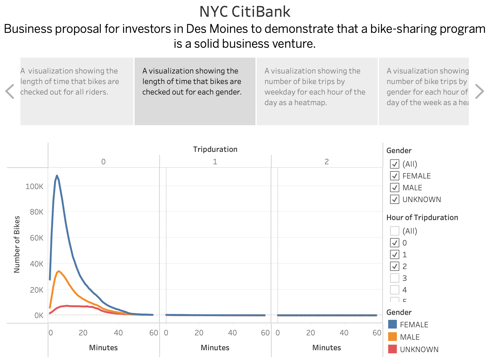

# Bike Sharing

Citi Bike is the nation's largest bike share program, with 25,000 bikes and over 1,500 stations located throughout Manhattan, Brooklyn, Queens, the Bronx, Jersey City, and Hoboken. 

Citi Bike is a fun and affordable way to get around town. It was designed with convenience in mind for quick trips. Citi Bike is frequently faster than other modes of transportation (particularly when traveling across town), and it is more convenient than owning a bike. Using Citi Bike instead of taxis can save you a lot of money. A year of Citi Bike is also less expensive than two monthly subway passes.

Business proposal for investors in Des Moines to demonstrate that a bike-sharing program is a solid business venture. 

## Overview of the analysis: 

The following analysis was conducted to demonstrate the potential of investing in a bike-sharing business for the city of Des Moines. There were key data players in this analysis and were used as filters and foundations for the results, they are as follow: 

- Trip duration
- Time of day
- Season
- Gender

## Results 

- The analysis was completed in Tableau to create dynamic and straightforward graphs to better comprehend the data.     Several graphs can be referenced below: 

#### Checkout Times for Users

    

	The above line graph shows the **average time** a bike was checked out by the users, which can be useful to offer fair pricing and ideal rental time slots for the bikes.  

#### Checkout Times by Gender

    

	The above graphic is a more detailed look into the checkout times, and it looks into **gender**, which can be useful to understand trends and how to cater to all demographics and perhaps offer bikes that can meet the needs of different users. 

#### August Peak Hours

    

	During the summer months, bike rentals tend to be at the highest since the weather is warm and people tend to spend their spare time outdoors, which is clearly reflected by the data and the bar chart above. In the month of August, a popular summer month, the most popular times were from **7 AM to 8 PM**.  

#### Top Ending Locations

    

	For a bike renting business to be effective there needs to be a clear understanding of areas within cities that have higher demand and where most of the bikes need to be allocated to ensure there is enough supply. The above visualization shows the **top ending locations** in NYC which reflects where the majority of the bikes were taken when they were checked out by the users. 

#### Trips by Weekday for Each Hour

    

	This heatmap shows the density of use per hour, clearly pointing to **higher bike use during the evenings and towards the weekend**. 

#### Trips by Gender per Hour

    

	This heatmap expands on the use per weekday by the hour in terms of gender, to get a **clearer idea of peak use time for different demographics**. 

#### User Trips by Gender by Weekday

    

	This heatmap displays the usage by user type, that being a subscriber to a bike rental subscription or a regular paying customer who checks out a bike for a single-use trip. The heatmap shows, the user type, the **gender** and the usage **per day** by the **start time**. 

## Summary 

This data analysis provides insightful information for investors into the demand for bike renting businesses in New York which can be implemented in cities like Des Moines. It's clear there is a high demand for bikes, regardless of gender and it appears to be a popular method of transportation be it for day-to-day needs to more touristic uses.

Based on the data set provided, I would have conducted an analysis of hours where bikes were used the least, to plan out the most ideal time slots for maintenance of the bikes across the stations to ensure bikes are always ready to be checked out without inconveniencing users and customers.

Another analysis that can be useful to conduct would be to take into consideration the distances transited by users, and with this information try to set up a more efficient plan for stations that allow for more reachability for all commutes.

